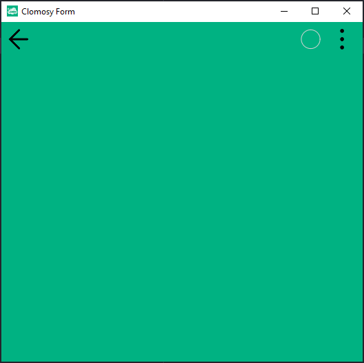

# 10.Bölüm 1.Örnek

### Açıklama

Örnekte, bir `TclForm` nesnesi oluşturulmuş ve bu nesneye bir renk düzenlemesi yapılmıştır. `AnaForm` adında bir `TclForm` nesnesi `Create` metodu ile başlatılmıştır ve ardından `SetFormColor` metodu kullanılarak formun rengi belirlenmiştir. Burada formun arka plan rengi `#00b282` (yeşil bir ton) olarak tanımlanmıştır. Son olarak, `Run` metodu çağrılarak formun çalıştırılması sağlanmıştır.

