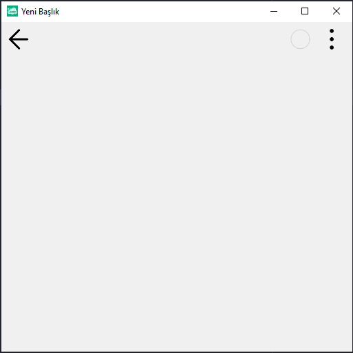

# 10.Bölüm 10.Örnek

### Açıklama

Örnekte, `TclForm` nesnesi ile bir form oluşturulmuş ve `AnaForm.clSetCaption('Yeni Başlık')` komutu kullanılarak formun başlığı 'Yeni Başlık' olarak değiştirilmiştir. `AnaForm=TclForm.Create(Self)` ile form nesnesi oluşturulur, ardından `AnaForm.clSetCaption('Yeni Başlık')` ile form başlığı değiştirilir. Son olarak, `AnaForm.Run` komutu ile form çalıştırılır.

`NOT:` Bunu görebilmek için uygulamayı Windows platformunda çalıştırınız.  

