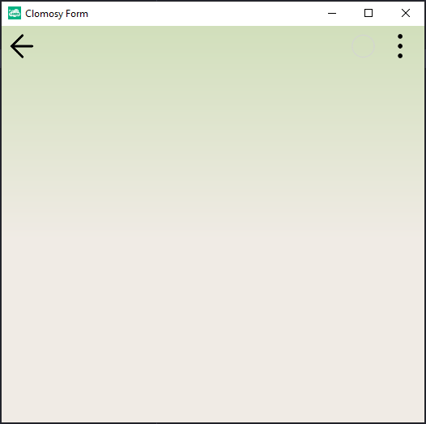

# 10.Bölüm 2.Örnek

### Açıklama

Örnekte, `AnaForm` adlı bir `TclForm` nesnesi oluşturulmuş ve bu nesnenin renk düzenlemesi yapılmıştır. `Create` metodu ile form başlatılmıştır. `SetFormColor` metodu kullanılarak formun arka plan ve metin renkleri belirlenmiştir. İlk renk (`#d1dfbb`) formun arka plan üst rengini, ikinci renk (`#f0ebe5`) ise alt rengini belirler. Renk geçişi ise `clGVertical` parametresiyle dikey bir geçiş tarzında ayarlanmıştır. Son olarak, `Run` metodu ile formun çalıştırılması sağlanarak kullanıcıya gösterilmesi sağlanmıştır.

