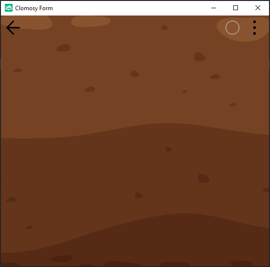

# 10.Bölüm 3.Örnek

### Açıklama

Örnekte, `AnaForm` adlı bir `TclForm` nesnesi oluşturulmuş ve bu nesnenin arka planına bir resim eklenmiştir. `Create` metodu ile form başlatılmıştır. `SetFormBGImage` metodu kullanılarak formun arka planına belirtilen URL'den (`'https://clomosy.com/demos/toprak.png'`) bir resim yüklenmiştir. Son olarak, `Run` metodu ile form çalıştırılmış ve kullanıcının görüntülemesi için açılmıştır.

