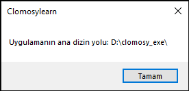

# 10.Bölüm 4.Örnek

### Açıklama

Örnekte, `UygulamaYolu` adlı bir değişken tanımlanarak, `Clomosy.AppBasePath` ile uygulamanın ana dizin yolu alınmıştır. Bu yol, uygulamanın çalıştığı dizinin tam yolunu belirtir. Ardından, `ShowMessage` fonksiyonu kullanılarak bu yol kullanıcıya bir mesaj olarak gösterilmiştir.

