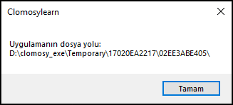

# 10.Bölüm 5.Örnek

### Açıklama

Örnekte, `UygulamaDosyaYolu` adlı bir değişken tanımlanarak, `Clomosy.AppFilesPath` ile uygulamanın dosya yoluna erişilmiştir. Bu yol, uygulamanın dosyalarına erişilebilecek ana dizini temsil eder. `ShowMessage` fonksiyonu kullanılarak bu dosya yolu kullanıcıya bir mesaj olarak gösterilmiştir. Bu, genellikle uygulama ile ilgili dosyaların bulunduğu konumu öğrenmek ve dosya işlemleri yapmak için kullanılır.

  