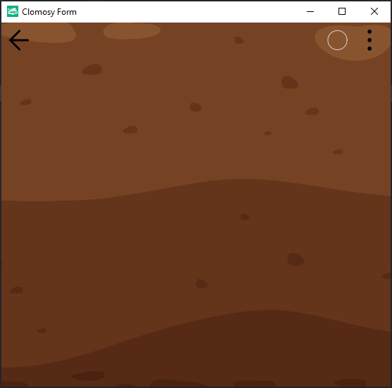

# 10.Bölüm 7.Örnek

### Açıklama

Örnekte, `TclForm` nesnesine bir dış URL'den görsel dosyası eklenmiştir. `AnaForm.AddAssetFromUrl('https://clomosy.com/demos/toprak.png')` komutu, belirtilen URL'deki 'toprak.png' proje dizinine ekler. Ardından, `AnaForm.SetFormBGImage('toprak.png')` komutuyla bu görsel formun arka planı olarak ayarlanır. Son olarak, `AnaForm.Run` komutu formu başlatarak kullanıcıya gösterir. 

