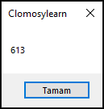
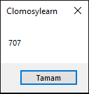

# 10.Bölüm 8.Örnek

### Açıklama

Örnekte, `TclForm` nesnesinin yüksekliği (`clHeight`) ve genişliği (`clWidth`) gösterilmektedir. `AnaForm=TclForm.Create(Self)` ile bir form nesnesi oluşturulur. Ardından, `ShowMessage(AnaForm.clHeight)` ve `ShowMessage(AnaForm.clWidth)` komutları, formun başlangıçtaki yüksekliğini ve genişliğini ekranda kullanıcıya bildirir. `AnaForm.Run` komutu ise formu başlatarak gösterir. 

`NOT:` Her cihazda boyutlar farklıdır. Bu sebepten sayılar farklı gelecektir.

