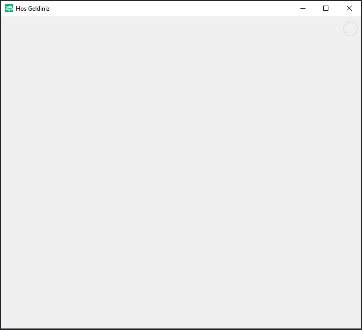

# 10.Bölüm 2.soru

### Açıklama

Windows platformu üzerinde bir form açıldığında aşağıdaki özellikleri içermelidir:
* Form açıldığında tam ekran olarak ekrana getiriniz.
* Form başlığını "Hoş Geldiniz" olarak ayarlayınız.
* Formdaki "Geri" (BtnGoBack) ve "Menü" (BtnFormMenu) butonlarını gizleyiniz.

