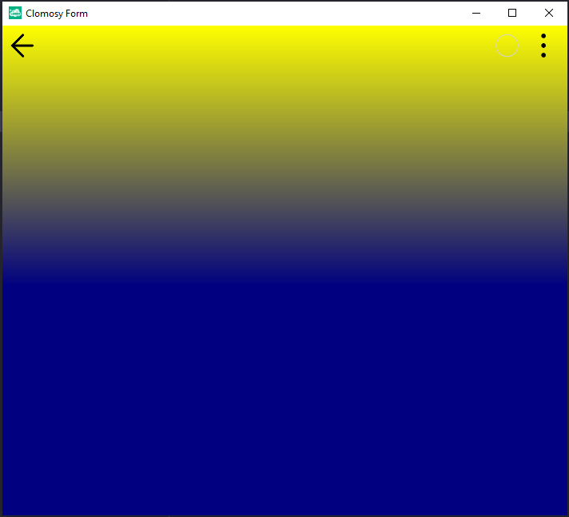

# 10.Bölüm 3.soru

### Açıklama

Formun arka planına, kullanıcıdan tuttuğu takımın renklerini belirleyerek dikey bir renk geçişi uygulayan bir program yazınız. Örneğin, Fenerbahçe için sarı ve lacivert, Beşiktaş için siyah ve beyaz kullanılabilir.

