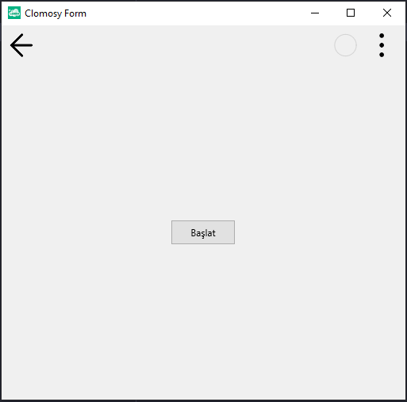

# 11.Bölüm 1.Örnek

### Açıklama

Örnekte, `TCLForm` türünde bir form (`Form1`) ve bu forma eklenen bir buton (`Buton1`) oluşturulmuştur. İlk olarak, `Form1 = TCLForm.Create(Self)` komutuyla yeni bir form nesnesi yaratılır. Ardından, `Buton1 = Form1.AddNewButton(Form1,'Buton1', 'Başlat')` ile form üzerine 'Başlat' yazılı bir buton eklenir. Bu buton, 'Buton1' adıyla tanımlanmış olup, formda görünen etiket olarak 'Başlat' kullanılacaktır. Son olarak, `Form1.Run` komutuyla form çalıştırılır.

