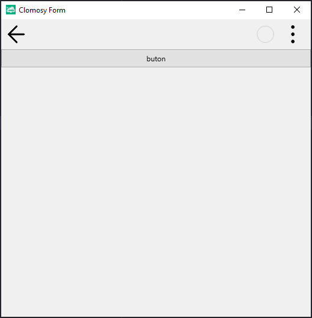

# 11.Bölüm 10.Örnek

### Açıklama

Örnekte, `TclForm` türünde bir form (`Form1`) oluşturulmuş ve bu form üzerine bir buton (`Buton1`) eklenmiştir. İlk olarak, `Form1 = TclForm.Create(self)` komutuyla form oluşturuluyor. Ardından, `Buton1 = Form1.AddNewButton(Form1, 'Buton1', 'buton')` komutuyla bir buton ekleniyor. Butonun etiket metni olarak `'buton'` değeri atanıyor. `Buton1.Align = alTop` komutuyla buton, formun üst kısmına hizalanıyor. Son olarak, `Form1.Run` komutuyla form çalıştırılıyor.

