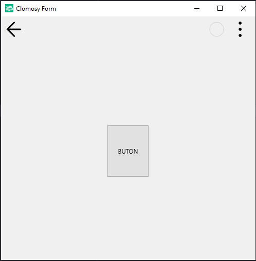

# 11.Bölüm 11.Örnek

### Açıklama

Örnekte, `TclForm` türünde bir form (`Form1`) oluşturulmuş ve üzerine bir buton (`Buton1`) eklenmiştir. İlk olarak, `Form1 = TclForm.Create(self)` komutuyla form oluşturuluyor. Ardından, `Buton1 = Form1.AddNewButton(Form1, 'Buton1', 'BUTON')` komutuyla buton ekleniyor ve butonun etiket metni olarak `'BUTON'` değeri atanıyor. Butonun yüksekliği, `Buton1.Height = 100` komutuyla 100 piksel olarak ayarlanıyor. Bu, butonun boyutunu değiştiren bir işlemdir. Son olarak, `Form1.Run` komutuyla form çalıştırılıyor.

