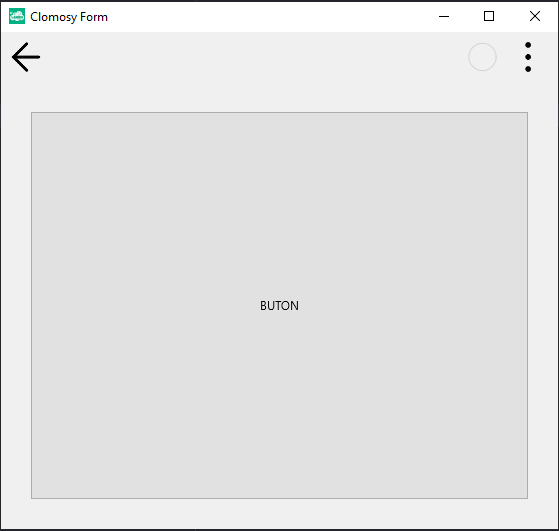

# 11.Bölüm 13.Örnek

### Açıklama

Örnekte, `TclForm` türünde bir form (`Form1`) oluşturulmuş ve üzerine bir buton (`Buton1`) eklenmiştir. Form oluşturulduktan sonra, `Buton1 = Form1.AddNewButton(Form1, 'Buton1', 'BUTON')` komutuyla buton eklenir ve butonun etiket metni `'BUTON'` olarak belirlenir. Buton, `Buton1.Align = alClient` komutuyla formun tamamını kaplayacak şekilde yerleştirilmiştir. Yani, buton formun tüm genişliğini ve yüksekliğini doldurur. Butonun etrafındaki boşlukları ayarlamak için, `Buton1.Margins.Left = 30`, `Buton1.Margins.Right = 30`, `Buton1.Margins.Top = 30`, ve `Buton1.Margins.Bottom = 30` komutları kullanılarak sol, sağ, üst ve alt margin değerleri 30 piksel olarak belirlenmiştir. Bu işlemler, butonun kenarlarında 30 piksellik boşluk bırakır. Son olarak, `Form1.Run` komutuyla form çalıştırılır.

