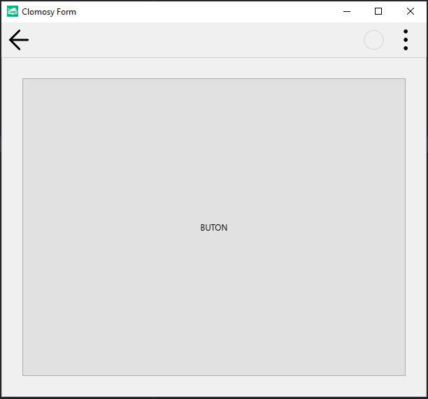

# 11.Bölüm 14.Örnek

### Açıklama

Örnekte, bir form (`Form1`) ve bu forma yerleştirilmiş bir panel (`Panel1`) ile buton (`Buton1`) oluşturulmaktadır. İlk olarak, `Form1 = TclForm.Create(self)` ile form oluşturulur. Ardından, `Panel1 = Form1.AddNewPanel(Form1, 'Panel1')` komutuyla form üzerine bir panel eklenir ve `Panel1.Align = alClient` ile panel formu tamamen kaplayacak şekilde hizalanır. Panelin içindeki kenar boşlukları, `Panel1.Padding.Left`, `Panel1.Padding.Right`, `Panel1.Padding.Top` ve `Panel1.Padding.Bottom` komutlarıyla her bir kenar için 30 piksel olarak ayarlanır. 

Panelin içine, `Buton1 = Form1.AddNewButton(Panel1, 'Buton1', 'BUTON')` komutuyla bir buton eklenir ve `Buton1.Align = alClient` ile buton panelin tamamını kaplayacak şekilde hizalanır. Bu yapılandırma, formun tamamını dolduran bir panel ve bu panel içinde düzgün hizalanmış bir buton oluşturur. Son olarak, `Form1.Run` komutuyla form çalıştırılarak uygulama görüntülenir. 

