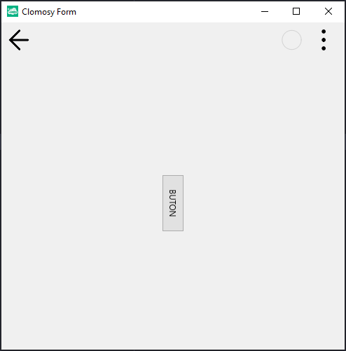

# 11.Bölüm 16.Örnek

### Açıklama

Örnekte, bir form (`Form1`) ve bu formun üzerine eklenen bir buton (`Buton1`) oluşturulmaktadır. `Form1 = TclForm.Create(self)` komutuyla form tanımlanır ve `Buton1 = Form1.AddNewButton(Form1, 'Buton1', 'BUTON')` ile form üzerine bir buton eklenir. 

Bu butona `Buton1.RotationAngle = 90` komutuyla 90 derece döndürme açısı atanır, bu da butonun dikey bir görünüme sahip olmasını sağlar. Form, `Form1.Run` komutuyla çalıştırılarak bu ayarların sonucu ekranda gösterilir. 

