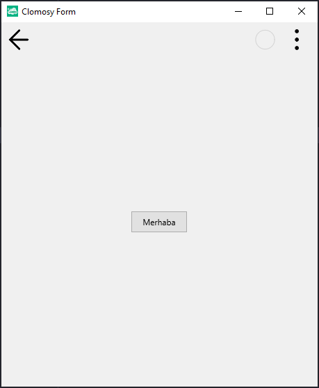
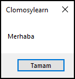

# 11.Bölüm 18.Örnek

### Açıklama

Örnekte, bir form (`Form1`) oluşturulmuş ve bu forma bir buton (`Buton1`) eklenmiştir. Butonun metni (`Text`) "Merhaba" olarak ayarlanmış ve ardından `ShowMessage` ile bu metin bir mesaj kutusunda kullanıcıya gösterilmiştir. Form çalıştırıldığında, buton üzerinde "Merhaba" yazısı görüntülenir ve aynı yazı mesaj kutusu ile kullanıcıya iletilir.

