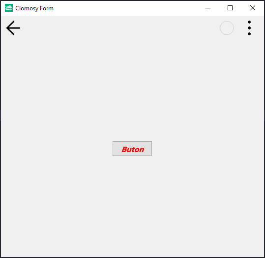

# 11.Bölüm 19.Örnek

### Açıklama

Örnekte, bir form (`Form1`) oluşturularak üzerine bir buton (`Buton1`) eklenmiştir. Bu butonun yazı stili ayarları özelleştirilmiştir. Öncelikle `StyledSettings` özelliği `ssFamily` olarak ayarlanarak varsayılan stil ayarları devre dışı bırakılmıştır. Ardından, `TextSettings` özelliği kullanılarak butonun yazı rengi kırmızı yapılmış, yazı tipi boyutu 16 olarak belirlenmiş ve yazıya italik ile kalın stil eklenmiştir. Form çalıştırıldığında, belirlenen özelliklere sahip bir buton görüntülenir.

