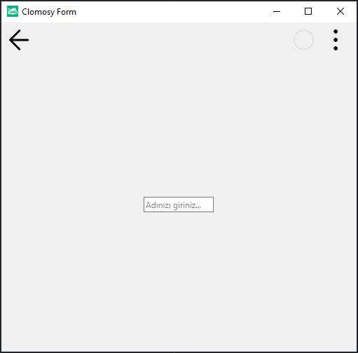

# 11.Bölüm 2.Örnek

### Açıklama

Örnekte, `TclForm` türünde bir form (`Form1`) ve bu forma eklenen bir metin kutusu (`Edit1`) oluşturulmuştur. İlk olarak, `Form1 = TclForm.Create(Self)` komutuyla yeni bir form nesnesi oluşturulur. Ardından, `Edit1 = Form1.AddNewEdit(Form1, 'Edit1', 'Adınızı giriniz...')` komutuyla form üzerine bir metin kutusu eklenir. Bu metin kutusu, kullanıcıya 'Adınızı giriniz...' şeklinde bir yer tutucu (placeholder) metni gösterir. Son olarak, `Form1.Run` komutuyla form çalıştırılır.

