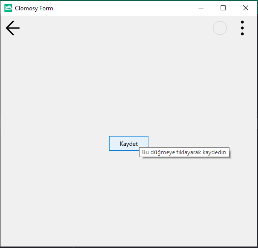

# 11.Bölüm 20.Örnek

### Açıklama

Örnekte, bir form (`Form1`) üzerinde bir buton (`Buton1`) eklenmiş ve bu butonun `Hint` özelliği ayarlanmıştır. `Hint` özelliği, kullanıcı fareyi butonun üzerine getirdiğinde gösterilecek olan açıklama metnidir. Bu örnekte, butona "Bu düğmeye tıklayarak kaydedin" mesajı atanmıştır. Form çalıştırıldığında, kullanıcı butonun üzerine geldiğinde bu açıklama metni bir ipucu olarak görünecektir.

