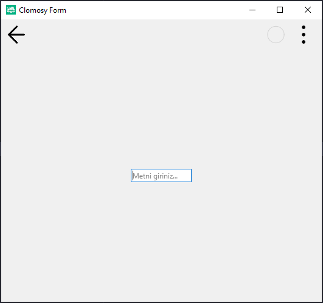

# 11.Bölüm 21.Örnek

### Açıklama

Örnekte, bir form (`Form1`) üzerinde bir metin girişi bileşeni (`Edit1`) oluşturulmuştur. `Edit1` bileşenine "Metni giriniz..." şeklinde bir başlangıç metni atanmıştır. Ayrıca, `setFocus` yöntemi kullanılarak uygulama başlatıldığında kullanıcı girişine hazır hale gelmesi sağlanmıştır. Bu sayede, kullanıcı form açıldığında doğrudan `Edit1` bileşenine yazmaya başlayabilir.

