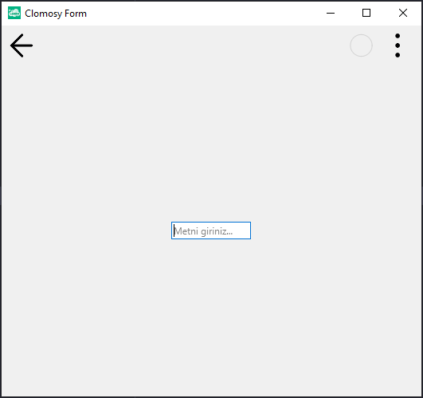

# 11.Bölüm 22.Örnek

### Açıklama

Örnekte, bir form (`Form1`) üzerinde bir metin girişi bileşeni (`Edit1`) oluşturulmuştur. `Edit1` bileşenine başlangıçta "Metni giriniz..." metni atanmış ve bileşen yalnızca okunabilir hale getirilmiştir (`ReadOnly = True`). Bu özellik sayesinde kullanıcı, `Edit1` bileşenindeki metni değiştiremez ancak görüntüleyebilir.

