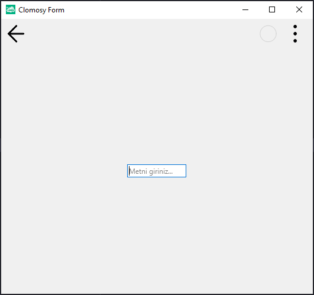

# 11.Bölüm 24.Örnek

### Açıklama

Örnekte, bir form (`Form1`) üzerinde bir metin girişi bileşeni (`Edit1`) oluşturulmuştur. `Edit1` bileşenine başlangıçta "Metni giriniz..." metni atanmış ve klavye türü `KeyboardType = vktEmailAddress` olarak ayarlanmıştır. Bu, kullanıcının yalnızca e-posta adresi girebileceği bir klavye düzeni sağlar. Bu özellik, mobil cihazlarda e-posta adresi girişi için uygun bir klavye ekranı açılmasını sağlar, böylece kullanıcıya sadece geçerli bir e-posta adresi girmesi beklenir.

