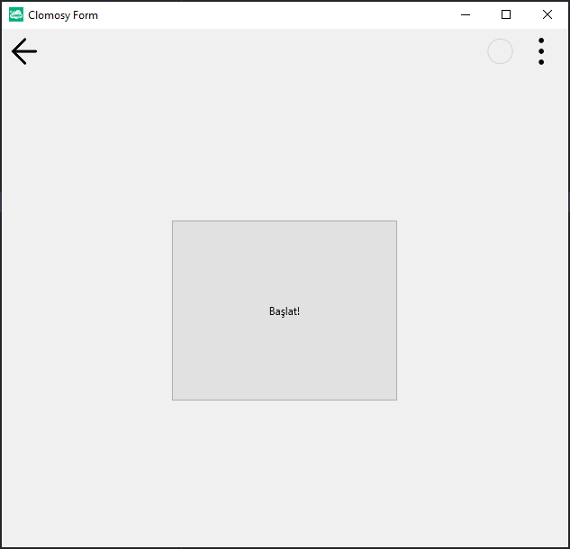

# 11.Bölüm 25.Örnek

### Açıklama

Örnekte, bir form (`Form1`) üzerinde bir buton (`Buton1`) oluşturulmuştur. Butonun metni "Başlat!" olarak ayarlanmış ve konumu `Align = AlCenter` ile ortalanmıştır. Ayrıca, butonun genişliği ve yüksekliği `Width = 250` ve `Height = 200` olarak belirlenmiştir. Bu, butonun formda ortalanmasını ve büyük bir boyutta görünmesini sağlar.

