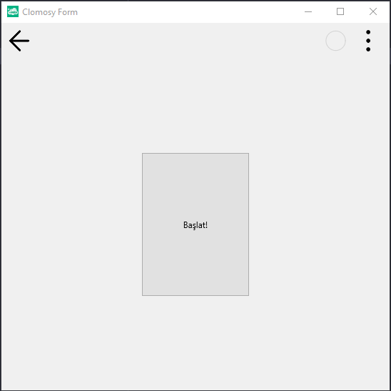

# 11.Bölüm 26.Örnek

### Açıklama

Örnekte, bir form (`Form1`) ve bir buton (`Buton1`) oluşturulmuştur. Butonun metni "Başlat!" olarak belirlenmiştir. `With` bloğu kullanılarak, butonun özelliklerine kolayca erişilmiştir ve bu sayede `Align`, `Width` ve `Height` gibi özellikler atanmıştır. Buton, `AlCenter` ile ortalanmış, genişliği 150 ve yüksekliği 200 olarak ayarlanmıştır. Bu yapı, butonun formda ortalanmasını ve belirli bir boyutta görünmesini sağlar. 

