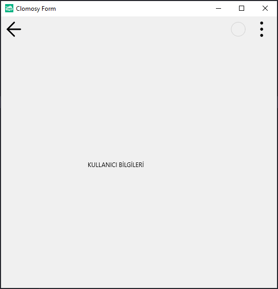

# 11.Bölüm 3.Örnek

### Açıklama

Örnekte, `TclForm` türünde bir form (`Form1`) ve bu forma eklenen bir etiket (`Label1`) oluşturulmuştur. İlk olarak, `Form1 = TclForm.Create(Self)` komutuyla yeni bir form nesnesi oluşturulur. Ardından, `Label1 = Form1.AddNewLabel(Form1, 'Label1', 'KULLANICI BİLGİLERİ')` komutuyla form üzerine bir etiket eklenir ve bu etiketin metni 'KULLANICI BİLGİLERİ' olarak belirlenir. Etiketin genişliği, `Label1.Width = 200` komutuyla 200 piksel olarak ayarlanır. Son olarak, `Form1.Run` komutuyla form çalıştırılır.

