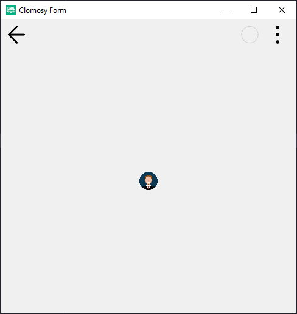

# 11.Bölüm 4.Örnek

### Açıklama

Örnekte, `TclForm` türünde bir form (`Form1`) ve bu form üzerine eklenen bir resim (`Img1`) gösterilmektedir. İlk olarak, `Form1 = TclForm.Create(Self)` komutuyla yeni bir form nesnesi oluşturulur. Ardından, `Form1.AddAssetFromURL('https://clomosy.com/learn/avatar.png')` komutuyla form için dışarıdan bir resim dosyası (`avatar.png`) URL üzerinden yüklenir. Sonrasında, `Img1 = Form1.AddNewImage(Form1, 'Img1')` komutuyla form üzerine bir resim eklenir. `Form1.setImage(Img1, 'avatar.png')` komutuyla daha önce indirilen resmi, `Img1` isimli resim bileşenine yükleriz. Son olarak, `Form1.Run` komutuyla form çalıştırılır. 

