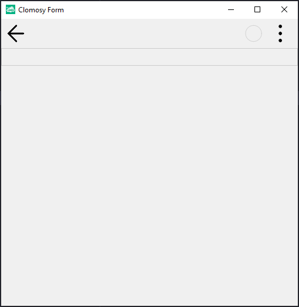

# 11.Bölüm 5.Örnek

### Açıklama

Örnekte, `TclForm` türünde bir form (`Form1`) oluşturulmuş ve bu forma bir panel (`Panel1`) eklenmiştir. İlk olarak, `Form1 = TclForm.Create(self)` komutuyla yeni bir form nesnesi oluşturuluyor. Ardından, `Panel1 = Form1.AddNewPanel(Form1,'Panel1')` komutuyla, `Form1` formuna bir panel ekleniyor. Bu panel, `Panel1` adıyla tanımlanmıştır. Son olarak, `Form1.Run` komutuyla form çalıştırılıyor.

