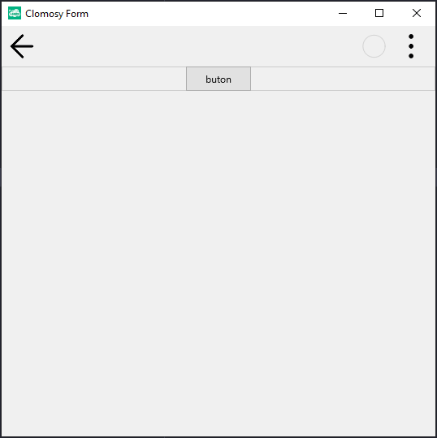

# 11.Bölüm 6.Örnek

### Açıklama

Örnekte, `TclForm` türünde bir form (`Form1`) oluşturulmuş ve bu forma bir panel (`Panel1`) eklenmiştir. Ardından, bu panel üzerine bir buton (`Buton1`) eklenmiştir. İlk olarak, `Form1 = TclForm.Create(self)` komutuyla yeni bir form nesnesi oluşturuluyor. Sonra, `Panel1 = Form1.AddNewPanel(Form1, 'Panel1')` komutuyla form üzerine bir panel ekleniyor. Bu panel içine, `Buton1 = Form1.AddNewButton(Panel1, 'Buton1', 'buton')` komutuyla bir buton ekleniyor. Butonun adı `Buton1` olarak belirlenmiş ve üzerinde 'buton' yazısı yer alıyor. Son olarak, `Form1.Run` komutuyla form çalıştırılıyor.

