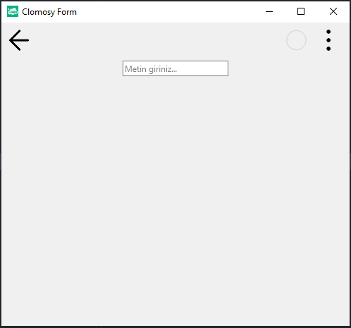

# 11.Bölüm 7.Örnek

### Açıklama

Örnekte, `TclForm` türünde bir form (`Form1`) oluşturulmuş ve bu forma bir düzen (layout) (`Layout1`) eklenmiştir. Ardından, bu düzen üzerine bir metin kutusu (`Edit1`) eklenmiştir. İlk olarak, `Form1 = TclForm.Create(self)` komutuyla yeni bir form nesnesi oluşturuluyor. Sonrasında, `Layout1 = Form1.AddNewLayout(Form1, 'Layout1')` komutuyla form üzerine bir düzen ekleniyor. Bu düzenin içinde, `Edit1 = Form1.AddNewEdit(Layout1, 'Edit1', 'Metin giriniz...')` komutuyla bir metin kutusu yerleştiriliyor ve bu kutunun başlangıç metni 'Metin giriniz...' olarak belirleniyor. `Edit1.Width = 150` komutuyla metin kutusunun genişliği 150 piksel olarak ayarlanıyor. Son olarak, `Form1.Run` komutuyla form çalıştırılıyor.

