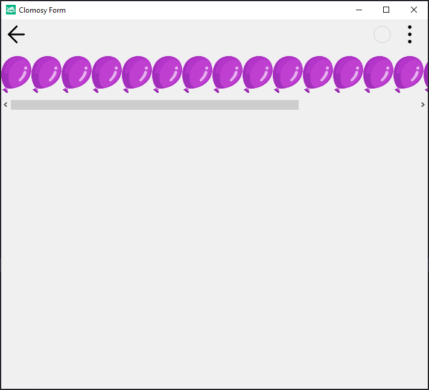

# 11.Bölüm 8.Örnek

### Açıklama

Örnekte, `TclForm` türünde bir form (`Form1`) oluşturulmuş ve bu forma bir yatay kaydırma kutusu (`TClHorzScrollBox`) eklenmiştir. Ardından, bu kaydırma kutusuna 20 adet resim (`Img1`) yerleştirilmiştir. İlk olarak, `Form1 = TclForm.Create(Self)` komutuyla yeni bir form nesnesi oluşturuluyor. `Form1.AddAssetFromUrl('https://clomosy.com/demos/balloon.png')` komutuyla form üzerinde kullanılacak bir görsel (balon resminin URL'si) ekleniyor. Sonrasında, `HorzScrollBox = Form1.AddNewHorzScrollBox(Form1, 'HorzScrollBox')` komutuyla yatay kaydırma kutusu ekleniyor ve `HorzScrollBox.Align = alMostTop` komutuyla kaydırma kutusunun formun üst kısmına hizalanması sağlanıyor. `HorzScrollBox.Height = 100` komutuyla kaydırma kutusunun yüksekliği 100 piksel olarak ayarlanıyor. Döngü içinde, 20 adet resim nesnesi oluşturuluyor, her birinin adı `Img1` ve numaralandırılarak (`Img1` + numara) kaydırma kutusuna ekleniyor. Her bir resmin `Align` özelliği `alLeft` olarak ayarlanıyor, yani resimler yatay olarak sıralanıyor. Resimlerin içeriği ise `Form1.SetImage(Img1, 'balloon.png')` komutuyla belirlenen görsel ile ayarlanıyor. Son olarak, `Form1.Run` komutuyla form çalıştırılıyor.

