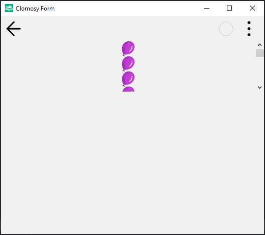

# 11.Bölüm 9.Örnek

### Açıklama

Örnekte, `TclForm` türünde bir form (`Form1`) oluşturulmuş ve bu form üzerine bir dikey kaydırma kutusu (`TClVertScrollBox`) eklenmiştir. Formda kullanılacak balon resmi URL üzerinden yükleniyor ve kaydırma kutusuna 20 adet resim ekleniyor. İlk olarak, `Form1 = TclForm.Create(Self)` komutuyla yeni bir form nesnesi oluşturuluyor. `Form1.AddAssetFromUrl('https://clomosy.com/demos/balloon.png')` komutuyla balon görseli form üzerine ekleniyor. Sonrasında, `VertScrollBox = Form1.AddNewVertScrollBox(Form1, 'VertScrollBox')` komutuyla dikey kaydırma kutusu ekleniyor ve `VertScrollBox.Align = alMostTop` komutuyla kaydırma kutusu formun üst kısmına hizalanıyor. `VertScrollBox.Height = 100` komutuyla kaydırma kutusunun yüksekliği 100 piksel olarak ayarlanıyor. Döngü içinde, 20 adet resim nesnesi oluşturuluyor, her birinin adı `Img1` ve numaralandırılarak (`Img1` + numara) kaydırma kutusuna ekleniyor. Resimlerin `Align` özelliği `alTop` olarak ayarlanıyor, yani resimler dikey olarak sıralanıyor. Son olarak, `Form1.Run` komutuyla form çalıştırılıyor.

