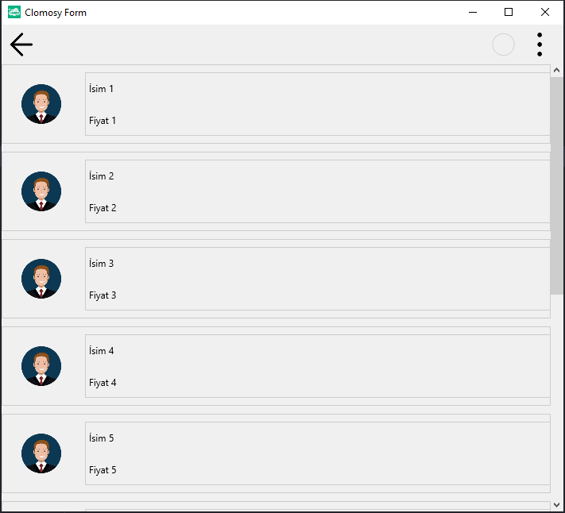

# 11.Bölüm 18.soru

## Açıklama

Bir ürün kataloğu uygulaması tasarlayınız. Bu uygulama, kullanıcıya ürün görselleri ve her bir ürünle ilgili açıklamalar sunmalıdır. Arayüzde 10 adet görsel yer almalı ve bu görseller dikey olarak kaydırılabilir olmalıdır. Her görselin yanında, ürünle ilgili bilgilendirme (isim, fiyat, açıklama gibi) içeren bir kutucuk yer almalıdır. Tasarımda kaydırma çubukları kullanarak, eklenen ürünlerin kolayca görüntülenebilmesi sağlanmalıdır.

