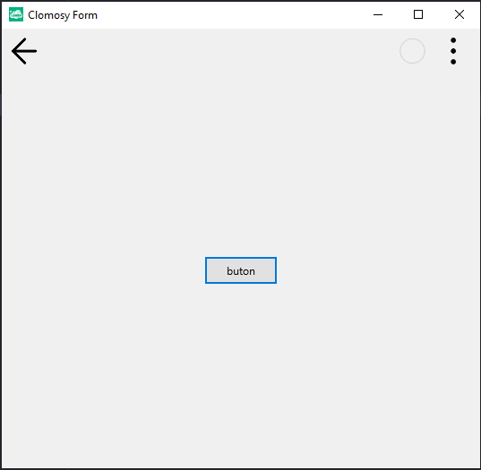
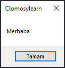

# 12.Bölüm 1.Örnek

### Açıklama

Örnekte, bir form (`Form1`) ve bir buton (`MesajBtn`) oluşturulmuştur. Buton, "buton" metniyle eklenmiştir. Ayrıca, bir `Selamla` adlı prosedür tanımlanmıştır. Bu prosedür, butona tıklanması durumunda "Merhaba" mesajını gösteren bir `ShowMessage` fonksiyonu çağırır. Butona, `tbeOnClick` olayı için `Selamla` prosedürü bağlanmıştır. Bu şekilde, kullanıcı butona tıkladığında `Selamla` prosedürü çalışacak ve "Merhaba" mesajı gösterilecektir.

