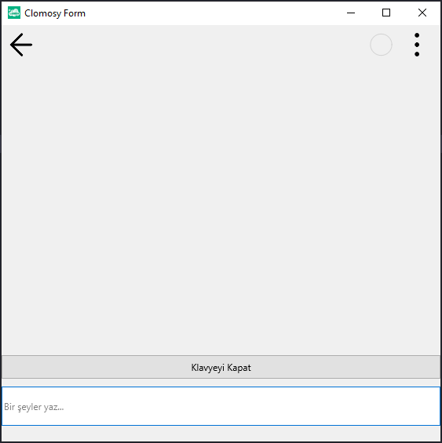

# 12.Bölüm 11.Örnek

### Açıklama

Örnekte, sanal klavye görünür veya gizlendiğinde form elemanlarının konumları dinamik olarak ayarlanmıştır. `KlavyeGoster` fonksiyonu, sanal klavye gösterildiğinde çalışır ve formdaki `Layout1`'ın alt marjını, klavye boyutuna göre ayarlar. Bu sayede sanal klavye görüntülendiğinde, alt kısmındaki edit kutusu görünür kalır.

`KlavyeGizle` fonksiyonu ise sanal klavye gizlendiğinde çalışarak, `Layout1`'ın alt marjını 20 piksel olarak ayarlayarak görünümü yeniden düzenler. Ayrıca, sanal klavye gösterildiğinde bir metin girişi yapılabilecek `EditYaz` ve sanal klavye gizlendiğinde kapanacak olan `ButonKapat` butonları da formda yer almaktadır.

`NOT:` Mobil cihazlarda üzerinde test ediniz. 

