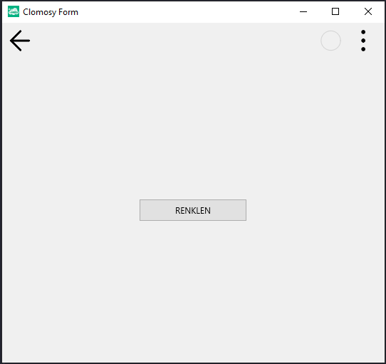
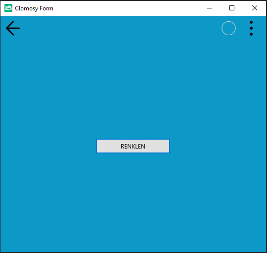

# 12.Bölüm 2.Örnek

### Açıklama

Örnekte, bir form (`Form1`) ve bir buton (`RenkBtn`) oluşturulmuş, butonun metni "RENKLEN" olarak belirlenmiştir. Ayrıca, `Renklen` adlı bir prosedür tanımlanmıştır. Bu prosedür, üç adet renk bileşeni (`Red`, `Green`, `Blue`) için rastgele değerler üretir ve bu değerleri kullanarak bir renk oluşturur. Üretilen renk, hex formatında (`Hex` değişkeni) saklanır. Daha sonra, `Form1.SetFormColor` fonksiyonu çağrılarak, formun arka plan rengi rastgele seçilen bu hex renk kodu ile değiştirilir.

Butona, `tbeOnClick` olayı için `Renklen` prosedürü bağlanmıştır, yani kullanıcı butona tıkladığında, formun arka plan rengi rastgele bir renk ile değişecektir.

