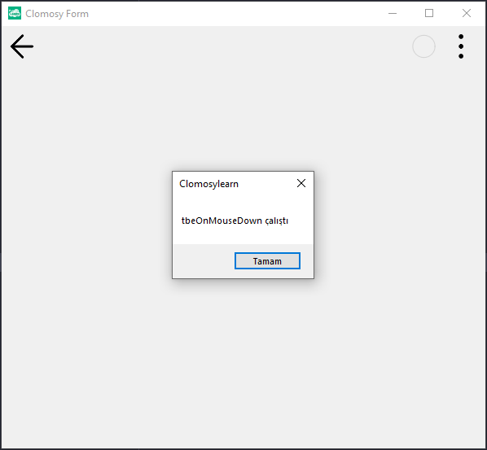

# 12.Bölüm 3.Örnek

### Açıklama

Örnekte, bir form (`Form1`) oluşturulmuş ve `MesajYaz` adlı bir prosedür tanımlanmıştır. Bu prosedür, formun üzerine tıklanıldığında "tbeOnMouseDown çalıştı" mesajını ekrana yazdıran bir `ShowMessage` fonksiyonu içerir.

Form oluşturulduktan sonra, `Form1.AddNewEvent` fonksiyonu kullanılarak formun `tbeOnMouseDown` olayına `MesajYaz` prosedürü bağlanmıştır. Yani, kullanıcı formun üzerine tıkladığında, `tbeOnMouseDown` olayı tetiklenir ve bu olayda tanımlı olan `MesajYaz` prosedürü çalışır. Bu sayede, formun üzerine tıklanıldığında bir mesaj kutusu açılır ve kullanıcıya bilgi verilir. Form çalıştırıldığında, tıklama olayına bağlı olarak bu işlem gerçekleşir.

