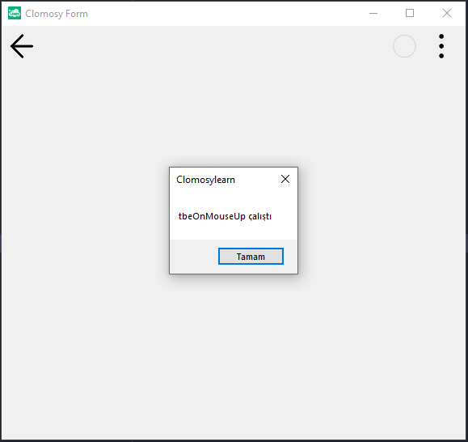

# 12.Bölüm 4.Örnek

### Açıklama

Örnekte, bir form (`Form1`) oluşturulmuş ve `MesajYaz` adlı bir prosedür tanımlanmıştır. Bu prosedür, form üzerinde fareyle tıklama bırakıldığında ("mouse up") "tbeOnMouseUp çalıştı" mesajını ekrana yazdırır.

Form oluşturulduktan sonra, `Form1.AddNewEvent` fonksiyonu kullanılarak formun `tbeOnMouseUp` olayına `MesajYaz` prosedürü bağlanmıştır. Yani, kullanıcı fareyi form üzerine tıkladıktan sonra bıraktığında, `tbeOnMouseUp` olayı tetiklenir ve bu olayda tanımlı olan `MesajYaz` prosedürü çalışır. Böylece, fare bırakıldığında bir mesaj kutusu açılır ve kullanıcıya bilgi verilir. Form çalıştırıldığında, fare bırakma olayına bağlı olarak bu işlem gerçekleşir.

