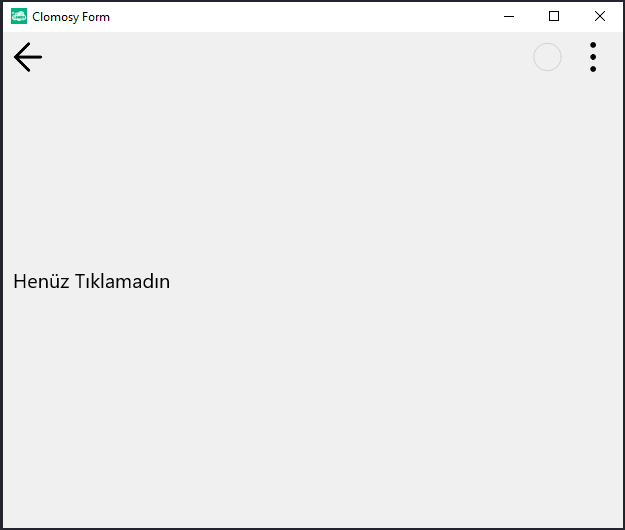
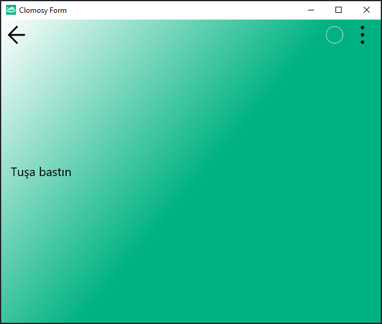
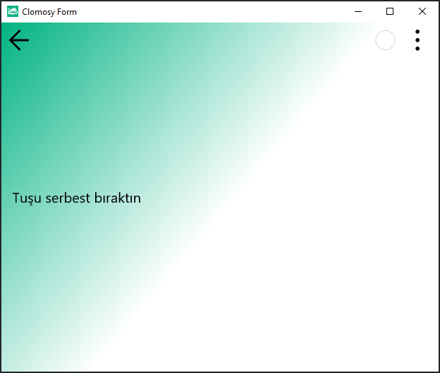

# 12.Bölüm 5.Örnek

### Açıklama

Örnekte, bir form (`Form1`) oluşturulmuş ve fare olaylarına tepki veren iki prosedür (`MouseBas` ve `MouseBirak`) tanımlanmıştır. 

* **MouseBas**: Fare basıldığında, formun arka plan rengi `#ffffff` ve metin rengi `#00b282` olarak ayarlanır. Ayrıca, `SonDurum` etiketinin (`TCLLabel`) `Caption` özelliği "Tuşa bastın" olarak değiştirilir.
* **MouseBirak**: Fare serbest bırakıldığında, formun arka plan rengi `#00b282` ve metin rengi `#ffffff` olarak değiştirilir. `SonDurum` etiketinin `Caption` özelliği ise "Tuşu serbest bıraktın" olarak güncellenir.

Bu olaylar form üzerinde fareyle tıklama ve bırakma işlemlerine bağlı olarak gerçekleşir. `Form1.AddNewEvent` fonksiyonlarıyla, formun `tbeOnMouseUp` ve `tbeOnMouseDown` olaylarına sırasıyla `MouseBirak` ve `MouseBas` prosedürleri atanır. Form çalıştırıldığında, kullanıcı fareyi tıkladıkça etiketin metni ve formun renkleri değişir.

