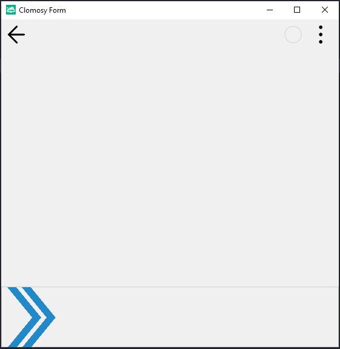

# 12.Bölüm 6.Örnek

### Açıklama

Örnekte, fare hareket ettikçe bir resmin (`Image1`) konumunu değiştiren bir TRObject kodu bulunmaktadır.

- **HareketEttir** prosedürü, fare hareket ettikçe, `Image1`'in `X` ve `Y` pozisyonlarını günceller. Bu işlem, `Form1.clSenderMousePosX` ve `Form1.clSenderMousePosY` değerlerine dayanır. `X` pozisyonu, fare hareketiyle aynı doğrultuda güncellenirken, `Y` pozisyonu formun `Y` konumunun yarısı kadar değiştirilir.
- **Form Yapılandırması**: 
  - `Panel1` formun alt kısmında yer alır ve yüksekliği 100 birim olarak ayarlanmıştır.
  - `Image1` resminin URL'si `'https://clomosy.com/WildRun/arrowButton_Mobile.png'` olarak belirlenmiştir. 
  - Resim, `Panel1`'in içinde yer almakta, ancak `Align` özelliği `alNone` olarak ayarlandığı için, manuel olarak konumlandırılacaktır.
  - Resim, `Panel1`'in yüksekliği kadar yüksek, aynı şekilde genişlik de panelin yüksekliği kadar belirlenmiş ve döndürülmüş (`RotationAngle = 180`).

Bu olay, fare hareket ettikçe `Panel1` içinde bulunan resmin konumunu yeniden ayarlar. `Form1.AddNewEvent` fonksiyonu ile, fare hareketi sırasında `HareketEttir` prosedürü tetiklenir.

