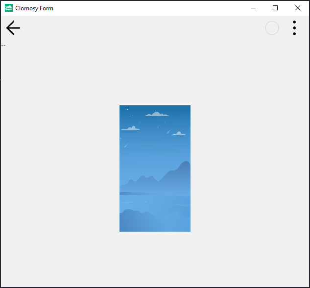

# 12.Bölüm 7.Örnek

### Açıklama

Örnekte, fare hareket ettikçe bir etiketin (`KonumLbl`) üzerinde fare pozisyonunu güncelleyen bir TRObject kodu bulunmaktadır.

- **MouseHareket Prosedürü**: 
  - Bu prosedür, fare hareket ettikçe çalışır ve `KonumLbl` etiketine fare pozisyonunun `X` ve `Y` koordinatlarını yazar. `Form1.clSenderMousePosX` ve `Form1.clSenderMousePosY` değerleri, fare pozisyonunun `X` ve `Y` koordinatlarını verir ve bu değerler etiketin metnine eklenir.
  
- **Form Yapılandırması**:
  - `KonumLbl`, fare pozisyonu bilgilerini göstermek için kullanılır ve formun üst kısmına (`alTop`) yerleştirilmiştir. Yüksekliği 20 birim olarak ayarlanmıştır.
  - `HareketImg` adlı bir resim eklenmiştir. Resmin URL'si `'https://clomosy.com/demos/bg.png'` olarak belirlenmiştir. Resim, formun ortasında (`alCenter`) konumlanır ve boyutları 260x145 olarak ayarlanmıştır.
  - `Form1.AddNewEvent` ile, fare hareket ettikçe `HareketImg` üzerinde `MouseHareket` prosedürünün tetiklenmesi sağlanmıştır.

Bu yapı ile, fareyi hareket ettirdikçe `KonumLbl` etiketinde fare pozisyonu sürekli olarak güncellenir.

