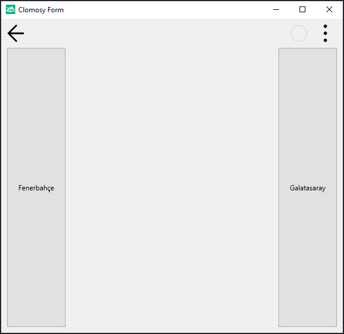
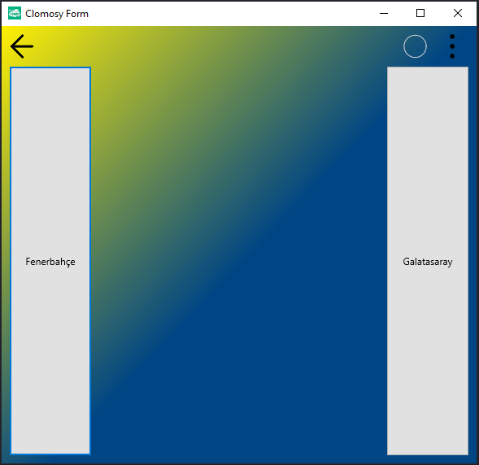
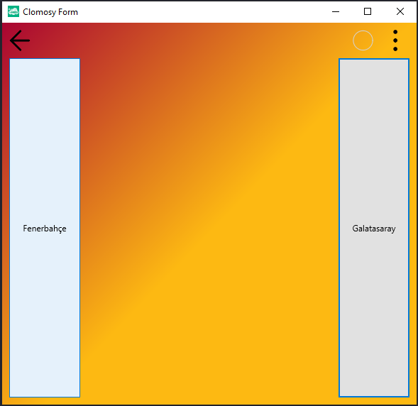

# 12.Bölüm 8.Örnek

### Açıklama

Örnekte, iki farklı buton olan `ButtonGS` ve `ButtonFB` kullanılarak, Galatasaray ve Fenerbahçe renkleriyle arka plan renkleri değiştirilmiştir. Butonlar, kullanıcı fareyi üzerine getirdiğinde `RenkVerGS` ve `RenkVerFB` olaylarına bağlı olarak farklı renkler atar. `ButtonGS` sağa, `ButtonFB` ise sola hizalanmış ve her iki buton da kenar boşlukları ve genişlikleriyle özelleştirilmiştir.

Kullanıcı, Galatasaray butonuna odaklandığında formun arka planı sarı ve kırmızıya, Fenerbahçe butonuna odaklandığında ise sarı ve laciverte dönüşür.

