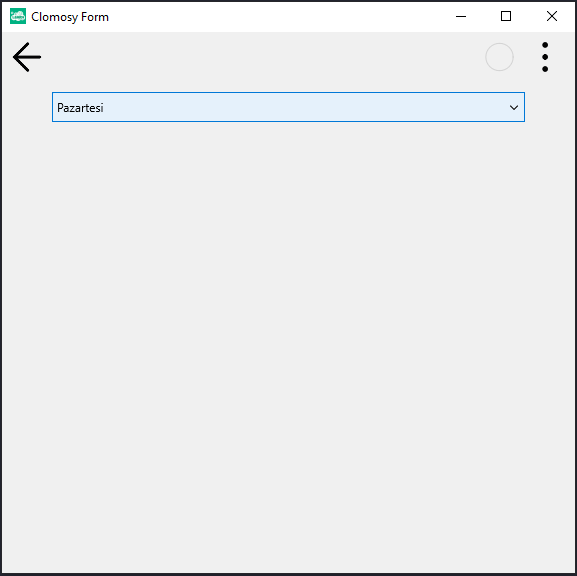
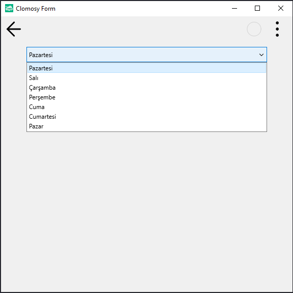
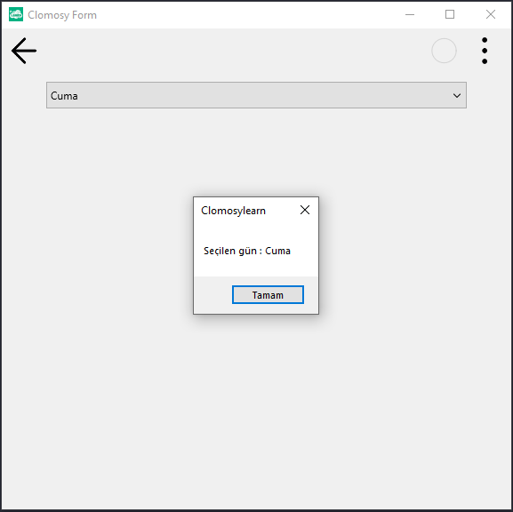

# 12.Bölüm 9.Örnek

### Açıklama

Örnekte, bir `ComboBox` (açılır liste) kullanılarak hafta günlerinin seçim işlemi yapılmıştır. `ComboBox1` öğesine, günlerin isimleri ve her birine karşılık gelen bir değer eklenmiştir. Kullanıcı bir gün seçtiğinde, `ComboSecilenDeger` fonksiyonu tetiklenir ve seçilen günün ismi ekranda gösterilir.

`ComboBox1`'in üst kısmına hizalanmış ve genişliği 150 piksel olarak ayarlanmıştır. Ayrıca, öğeler eklenirken her bir günün ismi ile birlikte benzersiz bir değer de eklenmiştir. `tbeOnChange` olayı kullanılarak, kullanıcı her seçim değiştirdiğinde bu olaya bağlı işlem gerçekleştirilir.

