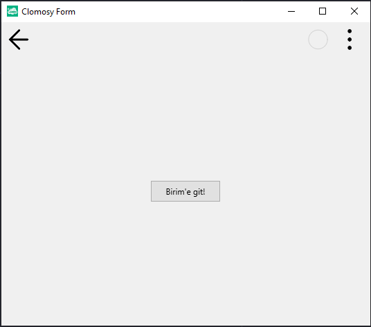

# 13.Bölüm 1.Örnek

### Açıklama

Örnekte, bir form üzerinde bir buton eklenmiş ve butona bir işlem tanımlanması amacıyla yorum satırı içinde `BirimeGit` fonksiyonu belirtilmiştir. Bu fonksiyon, butona tıklanıldığında yapılacak işlemi tanımlamak için kullanılabilir. Ancak, şu anda butona herhangi bir olay bağlanmamış (`AddNewEvent` satırı yorum halindedir). Buton, 'Birim'e git!' metniyle form üzerine eklenmiş ve genişliği 100 piksel olarak ayarlanmıştır.

Eğer butona tıklandığında bir işlem yapılması istenirse, `Form1.AddNewEvent(Button1,tbeOnClick,'BirimeGit');` satırı etkinleştirilebilir ve `BirimeGit` fonksiyonunda gerekli işlem tanımlanabilir.

