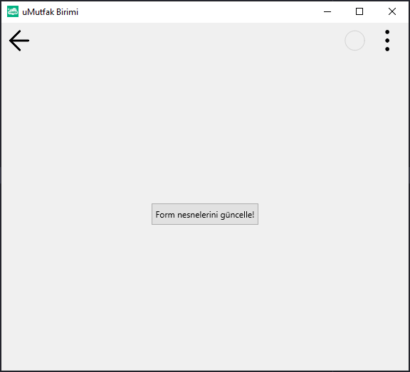

# 13.Bölüm 10.Örnek

### Açıklama

Örnekte, `Form2` üzerinde bir buton (`Button2`) ve bir fonksiyon (`AnaKodaGit`) bulunmaktadır. `AnaKodaGit` fonksiyonu, `LblAnaKod.Text` özelliğini `'Ana Kod -> uMutfak birimden geldi.'` olarak günceller, ardından `Form2`'yi gizler (`Form2.clHide`) ve önceki formu tekrar gösterir (`CallerForm.clShow`). Son olarak, `clDoClick(BtnAnaKod)` komutuyla, `Form1`'deki butona tıklanmış gibi bir işlem yapılır, böylece "Ana Kod" formu tekrar aktif hale gelir ve butonun işlevi tetiklenir. `Form2` başlığı `'uMutfak Birimi'` olarak belirlenmiştir ve butonun metni `'Form nesnelerini güncelle!'` olarak ayarlanmıştır.

`NOT:` Bu formun (Form2) başka bir forma (CallerForm) bağlıdır ve LblAnaKod değişkeni o formun (CallerForm) nesnesidir. Kullanırken mutlaka bir formdan çağırmanız gerektiğini unutmayın. Aksi takdirde hata ile karşılaşırsınız. 

