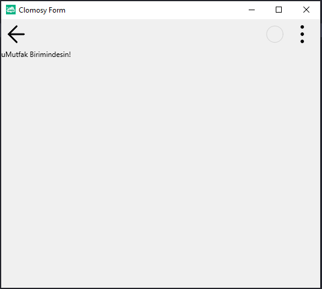

# 13.Bölüm 2.Örnek

### Açıklama

Örnekte, bir ikinci form (`Form2`) oluşturulmuş ve bu forma bir etiket (`LblMutfak`) eklenmiştir. Etiket, "uMutfak Birimindesin!" mesajını gösterir ve üst kısımda hizalanmış (`alTop`) olarak ayarlanmıştır. Bu etiket, form gösterildiğinde kullanıcıya bu birimde olduğunu belirten bir bilgi verir.

Form, `Form2.Run` komutuyla çalıştırılır ve form görüntülenir.

