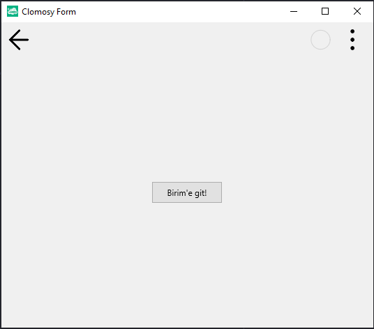

# 13.Bölüm 3.Örnek

### Açıklama

Örnekte, bir buton (`Button1`) oluşturulmuş ve bu buton tıklandığında `BirimeGit` fonksiyonu çağrılacak şekilde bir olay tanımlanmıştır. `BirimeGit` fonksiyonu, `Clomosy.RunUnit('uMutfak')` komutuyla `uMutfak` birimini çalıştırmak üzere ayarlanmıştır. Bu işlem, kullanıcı butona tıkladığında `uMutfak` biriminin yüklenmesini sağlar.

Buton, `Button1.Width = 100` ayarıyla genişliği 100 piksel olarak belirlenmiş ve butona tıklanma olayı (`tbeOnClick`) `BirimeGit` fonksiyonuna bağlanmıştır. Form çalıştırıldığında, kullanıcı butona tıkladığında `uMutfak` birimi çalıştırılır.

`NOT:` uMutfak adında bir birim (Unit) yoksa hiç bir işlem yapılmaz.

