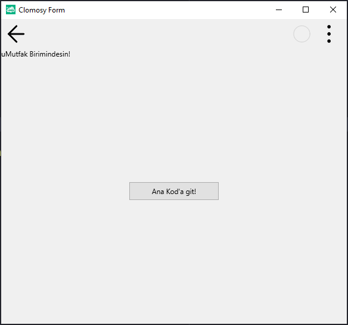

# 13.Bölüm 4.Örnek

### Açıklama

Örnekte, `Form2` üzerinde bir etiket (`LblMutfak`) ve bir buton (`Button2`) oluşturulmuştur. Etiket, kullanıcıya `uMutfak` biriminde olduklarını belirten bir mesaj gösterir. Buton, `AnaKodaGit` fonksiyonuna bağlanmış ve tıklandığında `Form2.clHide` komutunu çalıştırarak `Form2`'yi gizleyecektir.

Butona tıklanması ile `AnaKodaGit` fonksiyonu devreye girer ve bu fonksiyon, `Form2.clHide` komutu ile formu gizler. Buton genişliği 150 piksel olarak ayarlanmış ve `tbeOnClick` olayı ile butonun tıklanması beklenmektedir. Form çalıştırıldığında, kullanıcı butona tıkladığında `Form2` gizlenecektir.

