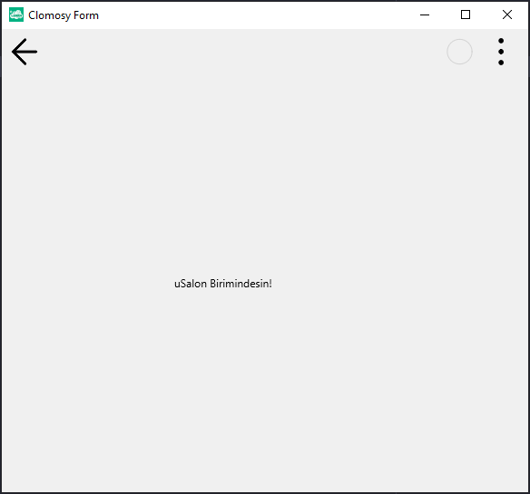

# 13.Bölüm 5.Örnek

### Açıklama

Örnekte, `Form3` üzerinde bir etiket (`LblSalon`) oluşturulmuştur. Etiket, kullanıcıya `uSalon` biriminde olduklarını belirten bir mesaj gösterir. Etiketin genişliği 200 piksel olarak ayarlanmış ve form çalıştırıldığında, bu etiket ekranda gösterilecektir. Form, `Form3.Run` komutu ile başlatılır.

