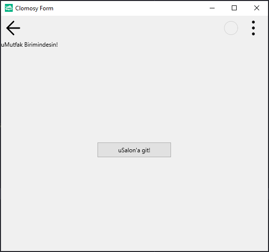

# 13.Bölüm 6.Örnek

### Açıklama

Örnekte, `Form2` üzerinde bir etiket (`LblMutfak`) ve bir buton (`Button2`) oluşturulmuştur. Etiket, kullanıcıya `uMutfak` biriminde olduklarını belirten bir mesaj gösterir. Butona tıklandığında ise `uSalonaGit` fonksiyonu çalıştırılarak, `Clomosy.RunUnit('uSalon')` komutu ile `uSalon` birimine geçiş yapılır. Bu sayede, kullanıcı birimi değiştirebilir. Butonun genişliği 150 piksel olarak belirlenmiş ve buton, `LblMutfak` etiketinin altına yerleştirilmiştir. Form çalıştırıldığında, kullanıcıya `uMutfak` birimi hakkında bilgi verilir ve butona tıklayarak `uSalon` birimine geçiş yapılabilir.

`NOT:` uSalon adında bir birim (Unit) oluşturulmamış ise yönlendirme yapılmayacaktır.

